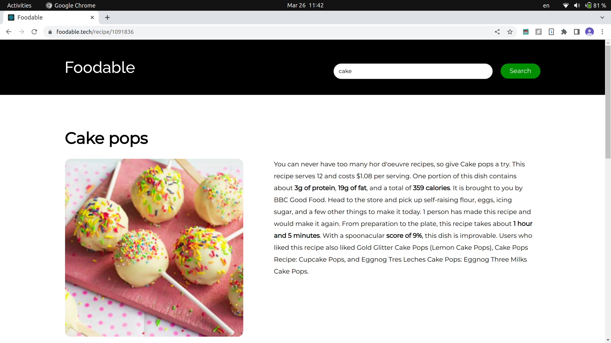

# Foodable

Foodable is a web application designed to make cooking easy, fun, and inspiring by helping users discover new recipes through various search methods. With Foodable, users can search for recipes by name, by image, or by ingredients they have on hand.

[Link to presentation](https://docs.google.com/presentation/d/1KDcDn-DE0w5510qwYw-5xH4wELGvDqDQuWcvEE_00Dc/edit?usp=sharing)




## Features

- User-friendly search options:
	- Search by name: Enter the name of a dish
	- Search by image: Upload a food image, and the AI-powered system will find matching recipes
	- Search by ingredients: Input ingredients you have on hand, and the app will display relevant recipes
- Browse and explore an extensive recipe database
- Responsive design for seamless experience on various devices


## Technologies

- Frontend: React, React Router, Axios
- Backend: Flask, TensorFlow (for image recognition)
- APIs: Spoonacular API (for recipes)


## Getting Started

### Prerequisites
- Node.js
- npm
- Python 3
- Flask

### Installation
1. Clone the repository: 
```
git clone https://github.com/yourusername/foodable.git
```

2. Navigate to the project directory:
```
cd foodable
```

3. Install the frontend dependencies:
```
cd client
npm install
```

4. Install the backend dependencies:
```
cd ../backend
pip install -r requirements.txt
```

## Running the Application
1. Start the backend server:
```
cd backend
python app.py
```
The backend server should be running at http://127.0.0.1:5000.

2. In a new terminal, start the frontend development server:
```
cd client
npm start
```
The frontend development server should be running at http://localhost:3000.

3. Open http://localhost:3000 in your browser to access the Foodable web application.

## Contributing
Pull requests are welcome. For major changes, please open an issue first to discuss what you would like to change.

## License
[MIT](https://choosealicense.com/licenses/mit/)